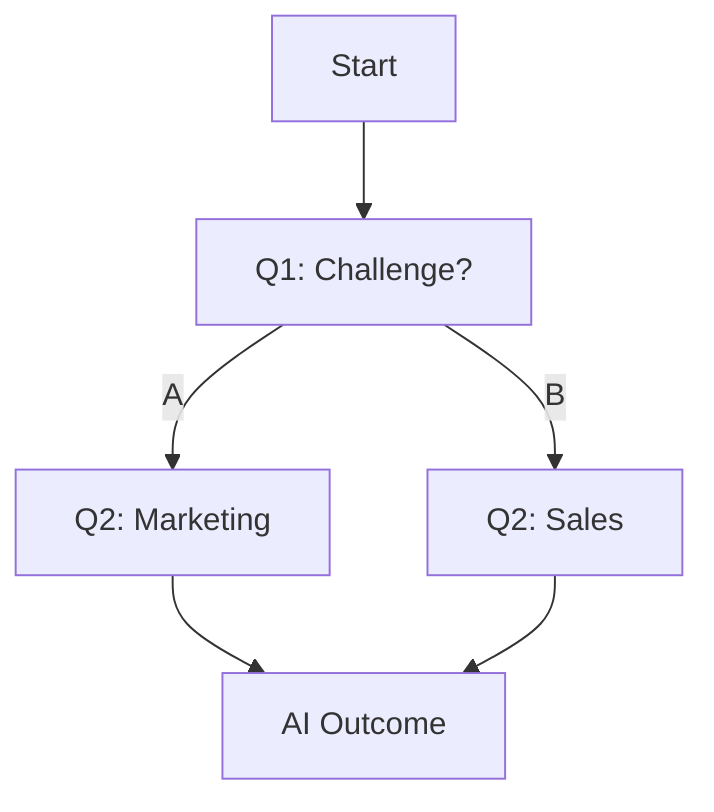

## Overview

Productised provides no-code tools to build AI-powered assessments that generate personalized reports and outcome pages for leads. You structure question flows, configure AI prompts for dynamic responses, customize branding, and track engagement metrics—all from an intuitive dashboard.

<Columns cols={3}>
  <Card title="Question Flows" icon="edit-3" href="#question-flows">
    Build branching logic without code.
  </Card>
  <Card title="AI Reasoning" icon="zap" href="#ai-reasoning">
    Generate context-aware outcomes.
  </Card>
  <Card title="Branding" icon="palette" href="#branding">
    Match your visual identity.
  </Card>
  <Card title="Analytics" icon="bar-chart-3" href="#analytics">
    Monitor leads and completions.
  </Card>
</Columns>

## Structuring Questions and Flows

Create assessments with drag-and-drop question blocks. Add single-choice, multi-select, or open-ended questions that branch based on responses.

<Steps>
  <Step title="Add Questions" icon="plus">
    Drag questions from the sidebar to build your flow.

````json
{
  "questions": [
    {
      "id": "q1",
      "type": "multiple_choice",
      "text": "What is your biggest challenge?"
    }
  ]
}
````
  </Step>
  <Step title="Set Branching" icon="git-branch">
    Define conditions like `if response == "A" then next: "q2"`.

    <Callout kind="tip">
      Use simple conditions for 90% of flows—no scripting required.
    </Callout>
  </Step>
  <Step title="Preview Flow" icon="eye">
    Test the entire assessment in real-time.
  </Step>
</Steps>



## Configuring AI Reasoning

Tailor AI prompts to produce personalized reports. You define the reasoning chain, and Productised generates dynamic content like recommendations or scores.

<Tabs>
  <Tab title="Basic Prompt" icon="edit">
    Set a core instruction for all outcomes.

````javascript
const prompt = `
Analyze responses and generate a personalized report.
Key factors: ${userResponses}
Output: Score + 3 recommendations.
`;
````
  </Tab>
  <Tab title="Advanced Chain" icon="link">
    Chain multiple AI steps for deeper insights.

````json
{
  "reasoning": [
    "Summarize responses",
    "Calculate maturity score",
    "Generate branded report"
  ]
}
````
  </Tab>
</Tabs>

<CodeGroup tabs="Dashboard,API">
```javascript
// Dashboard: Edit prompt directly
await productised.assessment.update({
  id: "assess-123",
  aiPrompt: "Generate lead-specific advice..."
});
```

```python
# API: Configure via endpoint
import requests
requests.post("https://api.example.com/v1/assessments/123/ai", 
              json={"prompt": "Your custom prompt here"})
```
</CodeGroup>

## Customizing Branding and Visuals

Match your brand with custom themes, logos, and colors. Upload assets and apply them across outcome pages and reports.

<Expandable title="Theme Configuration" default-open="true">
  Set primary color, fonts, and layouts.

| Element     | Customization Options          |
|-------------|--------------------------------|
| Header      | Logo, title, background color  |
| Outcome     | Cards, buttons, typography     |
| Report PDF  | Watermark, footer, styling     |

  Apply changes live—no redeploys needed.
</Expandable>

<Callout kind="success">
  Branded outcomes boost perceived value and conversion rates by 40%.
</Callout>

## Tracking Completion Rates and Lead Data

Monitor how users engage with your assessments. Access leads, drop-off points, and AI-generated insights via dashboard or webhooks.

<ParamField path="assessment_id" param-type="string" required="true">
  Unique ID for the assessment.
</ParamField>

<ResponseField name="leads" field-type="array" required="true">
  Array of completed responses with emails and scores.
</ResponseField>

<ResponseField name="completion_rate" field-type="number">
  Percentage of starts that finish (e.g., 0.75).
</ResponseField>

Set up webhooks for real-time notifications:

````javascript
// Webhook payload example
{
  "event": "assessment_completed",
  "data": {
    "email": "lead@example.com",
    "score": 85,
    "report": "Personalized content here"
  }
}
````

## Next Steps

<Columns cols={2}>
  <Card title="Build Your First Assessment" icon="rocket" href="/quickstart">
    Follow the quickstart guide.
  </Card>
  <Card title="API Reference" icon="code" href="/authentication">
    Integrate with your stack.
  </Card>
</Columns>