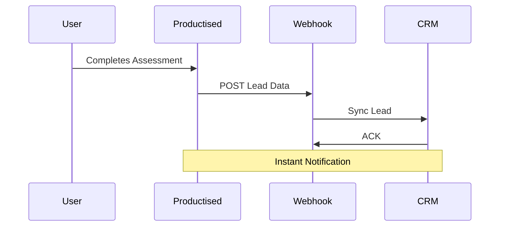

## Overview

Connect Productised assessments to your favorite CRMs, email platforms, and custom workflows. This enables instant lead syncing, automated notifications, and personalized follow-ups without manual intervention.

<Callout kind="info">
Review your integration settings in the Productised dashboard under the `Integrations` tab to ensure secure connections.
</Callout>

## CRM Integrations

Sync leads from completed assessments directly to your CRM. Productised supports native integrations with popular platforms.

<Tabs>
  <Tab title="HubSpot" icon="package">
    <Steps>
      <Step title="Connect Account" icon="link">
        Navigate to `Integrations > CRM` in your dashboard. Select HubSpot and authorize with OAuth.
      </Step>
      <Step title="Map Fields" icon="settings">
        Match assessment fields like `email`, `name`, and `score` to HubSpot properties.
      </Step>
      <Step title="Test Sync" icon="play">
        Complete a test assessment and verify the lead appears in HubSpot.
      </Step>
    </Steps>
  </Tab>
  <Tab title="Salesforce" icon="database">
    <Steps>
      <Step title="Generate API Key" icon="key">
        In Salesforce, create a connected app and note your `client_id` and `client_secret`.
      </Step>
      <Step title="Configure in Productised" icon="settings">
        Enter credentials in Productised and select the target object (e.g., `Lead`).
      </Step>
      <Step title="Verify" icon="check-circle">
        Trigger a webhook test to confirm data flows correctly.
      </Step>
    </Steps>
  </Tab>
</Tabs>

## Webhook Configuration

Set up webhooks to receive real-time notifications when users complete assessments. Post lead data to your endpoint.

<CodeGroup tabs="JavaScript,cURL,Python">
  ```javascript
  // Example webhook payload handler
  app.post('/webhook/productised', (req, res) => {
    const { email, name, assessment_score, responses } = req.body;
    // Sync to your CRM or database
    console.log(`New lead: ${name} (${email}) - Score: ${assessment_score}`);
    res.status(200).json({ received: true });
  });
  ```
  ```bash
  # Test webhook endpoint
  curl -X POST https://your-webhook-url.com/productised \
    -H "Content-Type: application/json" \
    -d '{
      "event": "assessment_completed",
      "lead": {
        "email": "user@example.com",
        "name": "John Doe",
        "score": 85
      }
    }'
  ```
  ```python
  # Flask webhook receiver
  from flask import Flask, request, jsonify

  app = Flask(__name__)

  @app.route('/webhook/productised', methods=['POST'])
  def webhook():
      data = request.json
      email = data['lead']['email']
      # Process lead
      print(f"Lead captured: {email}")
      return jsonify({"received": True}), 200
  ```
</CodeGroup>

<ParamField header="Productised-Signature" param-type="string" required="true">
  HMAC SHA-256 signature for verifying webhook authenticity. Use your webhook secret.
</ParamField>

## Embedding Assessments

Embed assessments on your website or landing pages for seamless lead capture.

```html
<iframe
  src="https://app.productised.ai/embed/{ASSESSMENT_ID}?theme=dark"
  width="100%"
  height="600"
  frameborder="0">
</iframe>
```

Replace `{ASSESSMENT_ID}` with your assessment ID from the dashboard.

## Popular Marketing Integrations

<Columns cols={3}>
  <Card title="Mailchimp" icon="mail" href="https://mailchimp.com" target="_blank">
    Automate welcome emails based on assessment outcomes.
  </Card>
  <Card title="Zapier" icon="zap" href="https://zapier.com" target="_blank">
    Connect to 5000+ apps with no-code zaps.
  </Card>
  <Card title="ActiveCampaign" icon="activity" href="https://activecampaign.com" target="_blank">
    Trigger personalized sequences from lead scores.
  </Card>
</Columns>

## Advanced Workflow



<Expandable title="Troubleshooting Integrations" default-open="false">
Common issues include mismatched field mappings or firewall blocks on webhook ports.

- Verify webhook URLs respond with `200 OK`.
- Check dashboard logs for sync errors.
- Test OAuth scopes for CRM access.
</Expandable>

<Callout kind="tip">
Start with webhooks for flexibility, then add native integrations as your workflow scales.
</Callout>